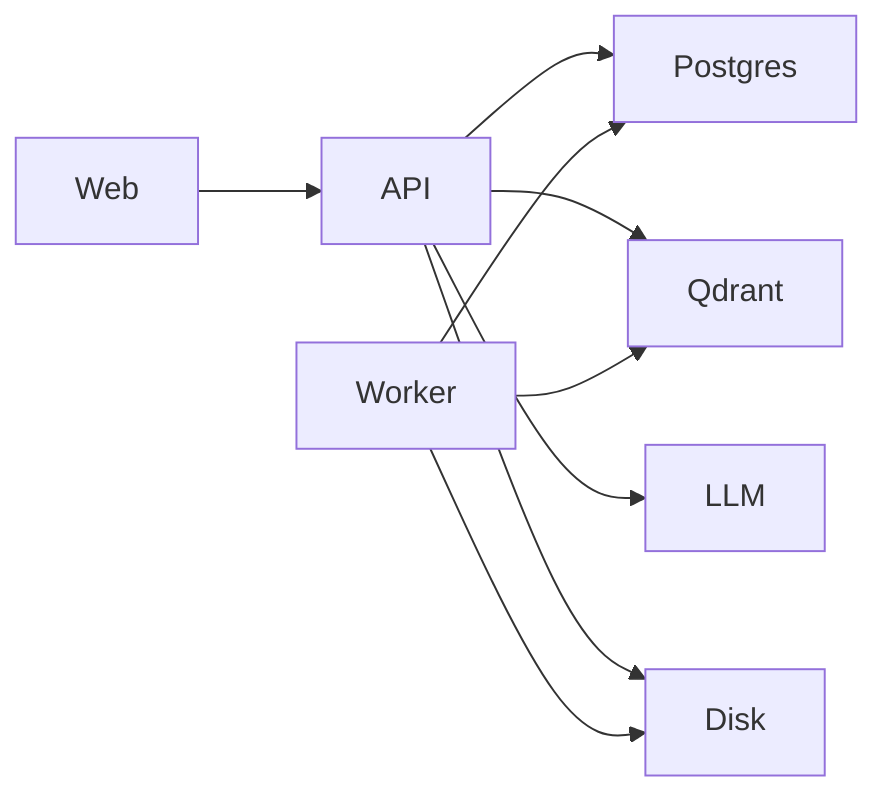
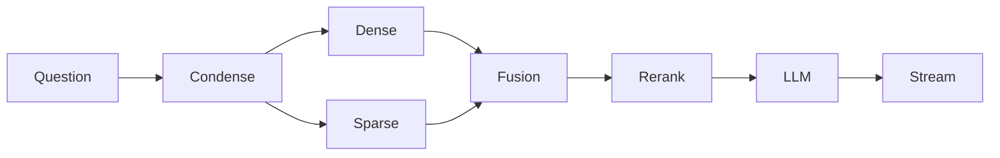

# Tome

Team knowledge assistant over project documents. Upload files to a project, ask questions, get a
streamed answer grounded in those files with citations. Each team sees only its own projects.

## Features

- Team and project isolation, enforced at the API and in every vector query
- Background ingestion: PDF, DOCX, PPTX, XLSX, EPUB, CSV, Markdown, text
- Hybrid retrieval, dense and BM25, fused then reranked by a cross-encoder
- Follow-up questions rewritten from the conversation before retrieval
- Token streaming over SSE, citations to document and section
- Conversations persisted and reopenable

## Stack

| Part | Detail |
| --- | --- |
| Backend | Python 3.12, FastAPI, SQLAlchemy, Alembic |
| RAG | LlamaIndex, Qdrant, FastEmbed |
| Embeddings | `nomic-embed-text-v1.5-Q` dense, `Qdrant/bm25` sparse |
| Reranker | `ms-marco-MiniLM-L-6-v2` |
| Parsing | AnyDoc |
| LLM | Any OpenAI-compatible endpoint |
| Database | PostgreSQL 17 |
| Frontend | React 19, TypeScript, Vite, TanStack Query, shadcn, Streamdown |

Embedding and reranking run in process on CPU. The only outbound call is to the LLM.

## Architecture



| Part | Role |
| --- | --- |
| Web | React client: projects, uploads, chat |
| API | FastAPI: auth, projects, documents, chat stream |
| Worker | Polls Postgres for jobs, parses, chunks, indexes |
| Postgres | Source of truth: users, teams, documents, jobs, messages, citations |
| Qdrant | Chunks with dense and sparse vectors, filtered by team and project |
| Disk | Uploaded files under generated names |

In containers, nginx serves the web build and proxies `/api` to the API; the API and the worker
share one image.

## How a question is answered



Both searches take the top 30 within the caller's project, fusion blends them, the reranker keeps
6, and the model answers from those passages only.

## Quick start

Everything in containers, served on http://localhost:8080:

```bash
cp backend/.env.example backend/.env                  # set LLM_API_KEY, LLM_MODEL, JWT_SECRET
docker compose up --build
```

Local development:

```bash
docker compose up -d postgres qdrant

cd backend
uv sync && cp .env.example .env                       # set LLM_API_KEY, LLM_MODEL, JWT_SECRET
uv run alembic upgrade head
uv run uvicorn tome.main:app --reload                 # :8000
uv run python -m tome.worker                          # second terminal

cd ../frontend
pnpm install && pnpm dev                              # :5173
```

## Docs

- [Backend](backend/README.md): API, ingestion, retrieval, tests, evaluation
- [Frontend](frontend/README.md): routes, streaming client, checks
- [Security](SECURITY.md): threat model and reporting

## License

[MIT](LICENSE)
