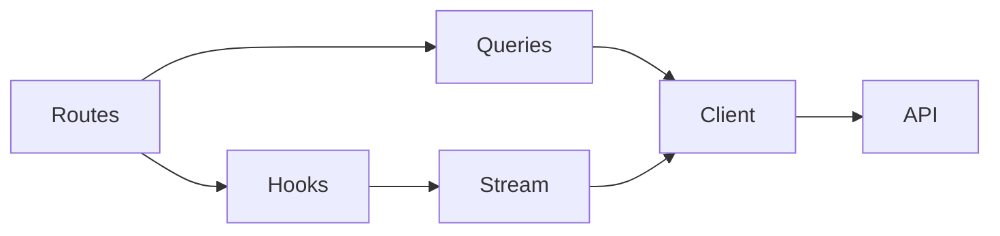
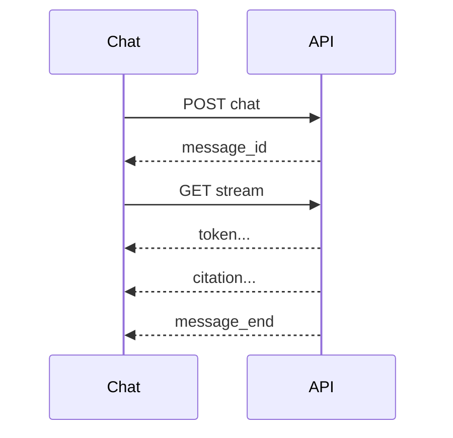

# Tome Frontend

[← Tome](../README.md)

The browser client for the knowledge assistant: register, create a project, upload documents, and
ask questions that are answered from those documents with citations.

## Architecture



| Part | Role |
| --- | --- |
| Routes | Pages: login, projects, chat, documents. Thin, render state |
| Hooks | `useChat`: one question, one stream, one transcript |
| Queries | TanStack Query for projects, documents, conversations; polls ingestion status |
| Stream | SSE parsed from `fetch`, so the token stays in a header, not the URL |
| Client | The only place `fetch` is called; maps every error to one `ApiError` |

### Asking a question



Tokens render through Streamdown as they arrive; citations fold under the answer. Leaving the page
aborts the stream.

## Requirements

- Node 22+ and pnpm
- The backend running on `http://localhost:8000`, plus its ingestion worker. See `../backend/README.md`.

## Setup

```bash
pnpm install
pnpm dev          # http://localhost:5173
```

Vite proxies `/api` to `http://localhost:8000`, so the backend needs no CORS configuration and
nothing here hardcodes a host. Point the app somewhere else with `VITE_API_URL`; it defaults to
`/api`.

## Walkthrough

Open `http://localhost:5173`, create an account, and create a project. Upload a document from the
Documents page, or with the paperclip in the chat input — either way it lands in the same project
and the worker indexes it in the background. The panel shows it move from queued to indexing to
ready, then stops polling.

Ask a question and the answer streams in token by token, with the passages it was built from folded
underneath. A question the documents do not cover is refused rather than guessed. Past
conversations are listed in the sidebar and survive a reload; the thread lives in the URL.

## Container

`Dockerfile` builds the app and serves it from nginx (`nginx.conf`), which also proxies `/api` to
the backend with buffering off for the answer stream, caps uploads, and rate-limits `/api/auth/`.
Run it with the rest of the stack from the repository root: `docker compose up --build`.

## Types

`src/api/types.ts` is generated from the backend's OpenAPI schema and committed, so a backend change
breaks the build rather than production. Regenerate it with the backend running:

```bash
pnpm types
```

## Checks

```bash
pnpm test         # Vitest over the SSE reader and the error mapping
pnpm build        # tsc -b && vite build
pnpm lint
```

Vitest covers the two pieces of real logic: parsing Server-Sent Events out of a byte stream, and
turning the backend's one error shape into one `ApiError`. Everything else is verified in a real
browser against a running backend, because that is the level at which "it works" is decided.

## Layout

```
src/api/        client, generated types, queries, the SSE reader — the only place fetch is called
src/auth.tsx    the token, and the route guard
src/hooks/      useChat: one question, one stream, one transcript
src/routes/     login, projects, project shell, chat, documents
src/components/ ui/ (shadcn on Base UI), prompt, answer, documents
```

Answers are rendered with [Streamdown](https://streamdown.ai), which renders Markdown correctly
while it is still half-written.
